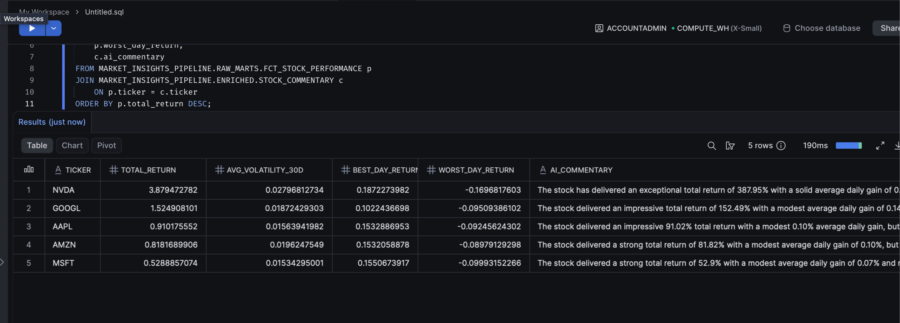

# Market Insights Pipeline

End-to-end data pipeline that ingests historical stock price data, computes financial
metrics (returns, volatility, drawdown) with **dbt**, and generates automated
analyst-style commentary using an **LLM (Groq API)**.

## Architecture

yfinance (Python) --> Snowflake (raw)
|
dbt staging
(stg_stock_prices)
|
dbt intermediate
(int_stock_metrics — daily return,
moving averages, rolling volatility)
|
dbt marts
(fct_stock_performance — aggregated
return, volatility, drawdown per ticker)
|
Groq API (Python script)
(generates natural-language commentary,
written back into Snowflake)

## Stack

- **Snowflake** — cloud data warehouse
- **dbt** (dbt-snowflake) — SQL transformations, testing, documentation
- **Python** — data ingestion (`yfinance`) and AI enrichment (`groq`)
- **Groq API** — fast LLM inference (`openai/gpt-oss-120b`), free tier
- **Docker** — reproducible development environment

## Why Groq instead of Snowflake Cortex

The project was originally designed to use Snowflake Cortex AI (`SNOWFLAKE.CORTEX.COMPLETE`)
to generate commentary natively inside the warehouse. As of 2026, Snowflake restricts
Cortex AI functions to accounts with a payment method on file — trial accounts no longer
have access. To keep the project fully free to run, the AI layer was moved to the
**Groq API**, which offers a genuinely free tier with no credit card required. The
architecture keeps data transformation (dbt) and AI enrichment (Python + Groq) as
separate, composable steps — arguably a cleaner separation of concerns.

## Prerequisites

- A Snowflake account (trial or paid) — [sign up here](https://signup.snowflake.com/)
- A free Groq API key — [console.groq.com](https://console.groq.com)
- Python 3.11+ (or Docker, see below)

## Setup

1. Clone the repo and install dependencies:

```bash
   make install
```

2. Copy `.env.example` to `.env` and fill in your Snowflake credentials and Groq API key:

```bash
   cp .env.example .env
```

3. Copy `profiles.yml.example` to `~/.dbt/profiles.yml` and fill in your credentials
   (or add the `market_insights_pipeline` block to your existing `profiles.yml` if you
   already use dbt with other projects).

4. Export the environment variables referenced in `profiles.yml` (e.g. `SNOWFLAKE_PASSWORD`),
   or configure your shell to load `.env` automatically.

5. Run the full pipeline:

```bash
   make all
```

Or run each step individually: `make load`, `make run`, `make test`, `make comment`.

## Running with Docker

Instead of setting up a local Python environment, run everything inside a container:

```bash
make docker-build
make docker-up
make docker-shell
```

Once inside the container, use the same `make` targets (`make load`, `make run`, etc.),
or run the scripts/dbt commands directly.

> Note: `~/.dbt/profiles.yml` still needs to be configured on your host machine — it's
> mounted read-only into the container.

## Project structure

market-insights-pipeline/
├── README.md
├── Makefile
├── Dockerfile
├── docker-compose.yml
├── dbt_project.yml
├── profiles.yml.example
├── .env.example
├── requirements.txt
├── models/
│ ├── staging/
│ │ ├── stg_stock_prices.sql
│ │ └── schema.yml
│ ├── intermediate/
│ │ └── int_stock_metrics.sql
│ └── marts/
│ ├── fct_stock_performance.sql
│ └── schema.yml
└── scripts/
├── load_data.py
└── generate_commentary.py

## Sample result

Aggregated performance and AI-generated commentary, queried from Snowflake:

```sql
SELECT
    p.ticker,
    p.total_return,
    p.avg_volatility_30d,
    p.best_day_return,
    p.worst_day_return,
    c.ai_commentary
FROM market_insights_pipeline.raw_marts.fct_stock_performance p
JOIN market_insights_pipeline.enriched.stock_commentary c
    ON p.ticker = c.ticker
ORDER BY p.total_return DESC;
```



## Cost

With an `X-SMALL` warehouse (auto-suspend enabled) and 5 tickers over 3 years of daily
data (~3,700 rows), the full pipeline runs in seconds and costs a fraction of a Snowflake
credit. The Groq API is free for this volume of usage.

## Branching

This project follows an environment-branch workflow: `users/<username>/<feature>` → `dev`
→ `main`, using [Conventional Commits](https://www.conventionalcommits.org/).
